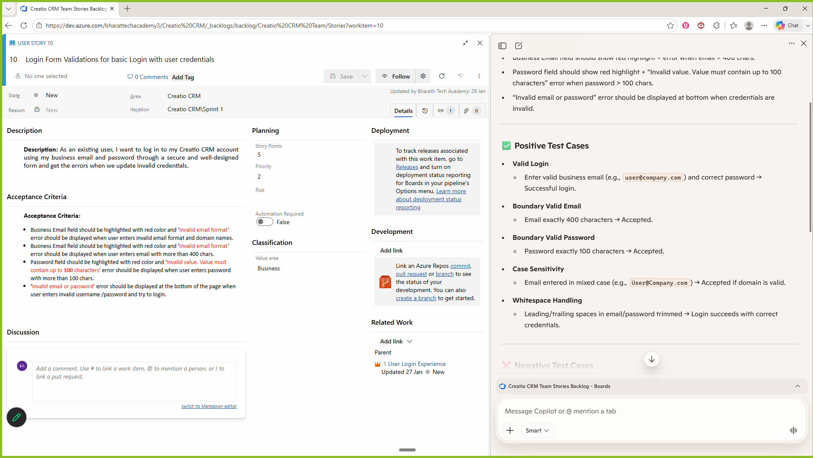

# prompt and prompt engineering frameworks 

## What is prompt? 
Prompt is all about a simple instruction or a question given to the AI model. 

## What is the importance of providing the right prompt? 
Only if we are going to provide the right prompt, we are going to get the better response. 

Example : 

Bad Prompt :
Explain Playwright ?

Good Prompt:
Currently, I am working as a Senior Automation Engineer. I already have very good knowledge of Java and Selenium. Now I want to learn Playwright to implement it in my current project, where I want to create a nice hybrid framework to automate my application UI, API, database, and other utilities. Can you please help me to learn Playwright and build the framework? 

## Prompt Engineering Frameworks 
Prompt engineering frameworks are nothing but a set of standard techniques which we can follow to get the best outcome from the AI model by providing a prompt in a more structured and systematic way. 

Some of the prompt engineering frameworks are 

1. RACE Framework
2. CLEAR Framework 

## RACE Framework

- R refers Role: For which Role you are going to use
- A refers Action: What exactly you want
- C refers Context: Context refer exact work
- E refers Examples: Any Existing example

### With & Without RACE Framework

### Without RACE Framework
Read the user story and write all the possible positive, negative, and edge cases for the given user story displayed on the current page.

### With RACE Framework
Role : As a senior quality analyst 

Action : Write all the possible positive, negative, and edge test cases for the given user story displayed on the current page. 

Context : This application is related to CREATIO CRM. It is a CRM-based application, and recently my developer designed the login page for this particular application. They have added a couple of validations to avoid invalid logins. Now I want to write all the possible test cases and identify the maximum defects. For that, I need detailed test cases with detailed step-by-step information to upload the test cases in Azure by following the standard Azure template. 

Example :  I want a CSV file to be generated with all positive, negative, and edge cases with detailed test steps as per the below format. 

TestCases.csv
==========
ID,Work Item Type,Title,Test Step,Step Action,Step Expected,Area Path,Assigned To,State
"159","Test Case","Verify whether cookies popup is getting displayed when user launch the application",,,,"Creatio CRM","Bharath Tech Academy <bharattechacademy3@outlook.com>","Design"
,,,"1"," Launch the browser. 

Browser = Chrome"," Browser should be launched successfully. ",,,
,,,"2"," Enter URL and launch the application. 

URL = https://accounts.creatio.com/login/alm"," application should be launched successfully. ",,,
,,,"3"," Verify whether Cookies popup is getting displayed ","cookies pop-up should get displayed before the login page to take the consent from the user. ",,,

### 2.CLEAR Framework
Clear framework is going to work very similarly to human-like responses, especially when it comes to this clear framework. Along with the race frameworks, we are also going to add an additional component called limitations. 

- C refers Context 
- L Refers to Limitations 
- E Refer to an Example
- A Refers to an Action 
- R Refers Role

Role : As a senior quality analyst 

Action : Write all the possible positive, negative, and edge test cases for the given user story displayed on the current page. 

Context : This application is related to CREATIO CRM. It is a CRM-based application, and recently my developer designed the login page for this particular application. They have added a couple of validations to avoid invalid logins. Now I want to write all the possible test cases and identify the maximum defects. For that, I need detailed test cases with detailed step-by-step information to upload the test cases in Azure by following the standard Azure template. 

Limitations :
- Do not generate duplicate test cases. 
- Do not add very generic test cases. 
- Don't add an ID number for each and every test case. 
- Don't add empty rows after each and every test case. 
- Don't generate more than 10 test cases per user story. 

Example :  I want a CSV file to be generated with all positive, negative, and edge cases with detailed test steps as per the below format. 

TestCases.csv
==========
ID,Work Item Type,Title,Test Step,Step Action,Step Expected,Area Path,Assigned To,State
"159","Test Case","Verify whether cookies popup is getting displayed when user launch the application",,,,"Creatio CRM","Bharath Tech Academy <bharattechacademy3@outlook.com>","Design"
,,,"1"," Launch the browser. 

Browser = Chrome"," Browser should be launched successfully. ",,,
,,,"2"," Enter URL and launch the application. 

URL = https://accounts.creatio.com/login/alm"," application should be launched successfully. ",,,
,,,"3"," Verify whether Cookies popup is getting displayed ","cookies pop-up should get displayed before the login page to take the consent from the user. ",,,